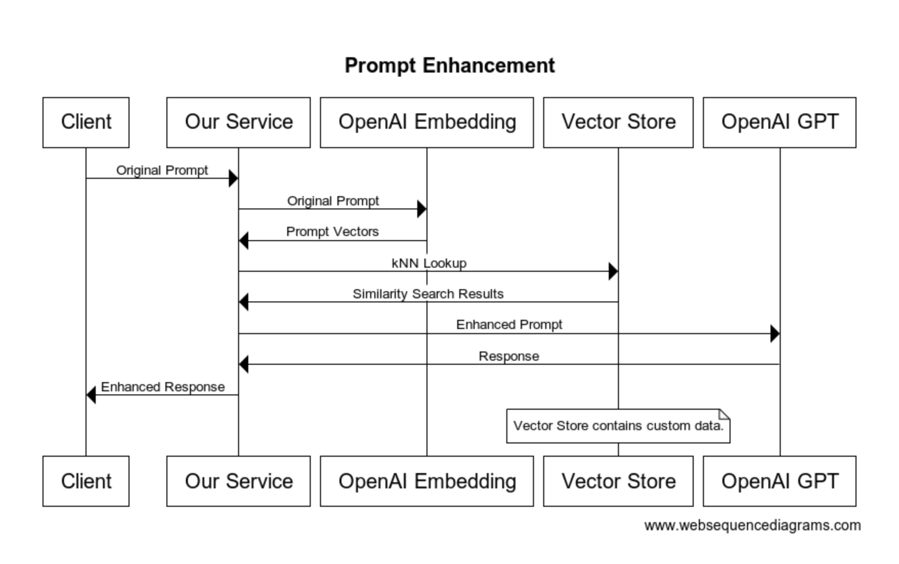
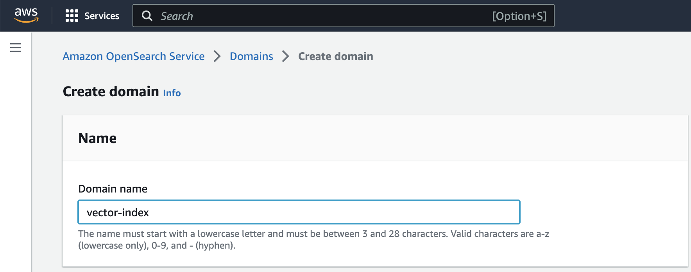

# Introduction
The release of ChatGPT was one of the most exciting technical events in recent history. After years of disappointing technological advancement, out of nowhere ChatGPT was released and reportedly hit [100M Monthly Active Users](https://au.finance.yahoo.com/news/chatgpt-on-track-to-surpass-100-million-users-faster-than-tiktok-or-instagram-ubs-214423357.html) within the span of two months, dwarfing the adoption rate of TikTok, Instagram, and other popular internet tools.

ChatGPT opens up many opportunites and use cases because it is able to synthesize terabytes of textual data into coherent responses to user queries. This capability is beyond human reach because, as individuals, we're unable to draw inferences in the way that ChatGPT can from the vast amount of data it is trained on.
# Embeddings
We have all seen how ChatGPT is adept at responding to human queries, but it has some limitations. One of the primary limitations that prevents it from helping with our daily work is that it has no access to our proprietary data sources. To work around this issue, a popular pattern is to integrate the GPT Embeddings API into the prompt chain.

Here is a diagram that explains how this works:



Instead of sending a prompt directly to GPT, you intercept the prompt entered by the user. Then you perform a kNN vector similarity search against your proprietary data. The vector similarity search returns facts related to the original prompt. The results from the vector store are appended to the prompt.

See [Question And Answering Using Embeddings](https://github.com/openai/openai-cookbook/blob/main/examples/Question_answering_using_embeddings.ipynb) for a Python notebook that walks through the process with a real life example.
# LlamaIndex
[LlamaIndex](https://github.com/jerryjliu/gpt_index) (previously GPT Index) is an excellent Python module that makes the process of working with Embeddings easier. Many walkthroughs exist for supplementing GPT with custom data, but they often use a simple vector store for data storage. When you are ready to build a production system, you will want to store the embeddings in a managed service.

There are multiple data store providers that provide kNN lookup for vector stores, but a good choice for those using AWS is to use Amazon's OpenSearch Service.
# Amazon OpenSearch Service
To start with, create an Amazon OpenSearch Service domain in the AWS console. For testing purposes you can choose the default options and create a master user and password.



Once created, check the access policy in the Security configuration tab. See [Identity and Access Management in Amazon OpenSearch Service](https://docs.aws.amazon.com/opensearch-service/latest/developerguide/ac.html) and [Fine-graned access control in Amazon OpenSearch Service](https://docs.aws.amazon.com/opensearch-service/latest/developerguide/fgac.html) for instructions on configuring access.

Copy the Domain endpoint URL from the OpenSearch console and test it as follows:
```
curl -XGET -u '<USERNAME>:<PASSWORD>' 'https://<DOMAIN_ENDPOINT>'
```
# Loading Data Into OpenSearch
For this example, I'm using the [Automatic Ticket Classification Dataset](https://www.kaggle.com/datasets/abhishek14398/automatic-ticket-classification-dataset) which is availble from https://kaggle.com to simulate my own proprietary data. I'm parsing out the customer complaints from the downloaded JSON file and storing them in a file called `cdata.txt` in a subdirectory named `data/`.

Here is the Python code that will seed the OpenSearch domain with the vector data:
```Python
from os import getenv
from llama_index import SimpleDirectoryReader
from llama_index.indices.vector_store import GPTOpensearchIndex
from llama_index.vector_stores import OpensearchVectorClient

def query(index, question):
	return index.query(question)

muser = getenv("OS_MASTER_USERNAME")
mpass = getenv("OS_MASTER_PASSWORD")
osendpoint = getenv("OS_ENDPOINT")
endpoint = f"https://{muser}:{mpass}@{osendpoint}"
idx = "gpt-index-demo"
documents = SimpleDirectoryReader('data').load_data()

text_field = "content"
embedding_field = "embedding"

client = OpensearchVectorClient(endpoint, idx, 1536, embedding_field=embedding_field, text_field=text_field)
index = GPTOpensearchIndex(documents=documents, client=client)
print(query(index, 'How could my roommate steal my Chase card?'))
```

Let's walk through the above code. `documents = SimpleDirectoryReader('data').load_data()` loads the text file(s) in our `data/` subdirectory into an index. This function splits our raw textual data into chunks, calls the OpenAI Embeddings API to vectorize them, and stores the raw text chunks and corresponding vectors as a list of llama_index Documents.

Once we have the vectorized contents of our source material, `OpensearchVectorClient` establishes a client connection to our OpenSearch domain. The dimensions are set to 1536 which corresponds with the vector size returned by the OpenAI Embedding model.

Next, `GPTOpensearchIndex` seeds OpenSearch with our data. `GPTOpensearchIndex` will store both the vectors and the original raw text in OpenSearch. This is convenient, because when we run `kNN` lookups to compare strings, we can easily reference the original text.

Finally, `print(query(index, 'How could my roommate steal my Chase card?'))` uses the index we just created to perform a query. I chose this prompt because within the customer complaint data there is an example of someone whose roommate stole their card by guessing the pin code, which was the same code to unlock the phone!

```
python main.py

> Adding chunk:
Good morning my name is XXXX XXXX and I apprec...
> Adding chunk: realize it until today, i checked my email and ...
> [build_index_from_documents] Total LLM token usage: 0 tokens
> [build_index_from_documents] Total embedding token usage: 4530 tokens
> [query] Total LLM token usage: 1286 tokens
> [query] Total embedding token usage: 9 tokens

Your roommate could have stolen your Chase card by taking it from your wallet or purse while you were sleeping or when you were not paying attention. He could have also taken it from your room or any other place where you keep it. He could have also used your phone password to guess your PIN and use the card to withdraw money from your account.
```
# Querying OpenSearch Directory
Now that we've demonstrated how to load data into OpenSearch, how do we perform subsequent queries? Below is an example:

```Python
def query_from_opensearch():
	llm_predictor = LLMPredictor(llm=OpenAI(temperature=0.9, model_name="text-davinci-003"))
	rdr = ElasticsearchReader(endpoint, idx)
	documents = rdr.load_data(text_field, embedding_field=embedding_field)
	index = GPTVectorStoreIndex(documents=documents, llm_predictor=llm_predictor, include_extra_info=False)
	print(query(index, 'How could my roommate steal my Chase card?'))
```

Here I demonstrate how to use `LLMPredictor` to fine tune the OpenAI options. In this case I increased the temperature to help ensure a greater variety in the model's output. I then use the `ElasticsearchReader` class to establish a connection to OpenSearch and I create an index from the OpenSearch data using `GPTVectorStoreIndex`. Note that `include_extra_info=False` is required to avoid chunk size limitations.

Here is the result from our new function:
```
python main.py
INFO:root:> [build_index_from_documents] Total LLM token usage: 0 tokens
INFO:root:> [build_index_from_documents] Total embedding token usage: 0 tokens
<llama_index.indices.vector_store.base.GPTVectorStoreIndex object at 0x12edf0eb0>
INFO:root:> [query] Total LLM token usage: 1268 tokens
INFO:root:> [query] Total embedding token usage: 9 tokens

Your roommate could have stolen your Chase card by taking it from your room while you were sleeping. He could have then used the card to withdraw money from your account by using your PIN, which he figured out because it was the same as your phone password.
```
# Conclusion
ChatGPT has revolutionized the field of natural language processing. While ChatGPT is adept at responses to human queries, it has limitations when it comes to proprietary data sources. However, by integrating the GPT Embeddings API and using tools like LlamaIndex and Amazon OpenSearch, developers can work around this issue and create solutions that incorporate  custom data sets. With the ability to synthesize terabytes of textual data into coherent responses to user queries, ChatGPT is a game-changer for the world of natural language processing, and we can expect to see many more exciting developments in the future.
