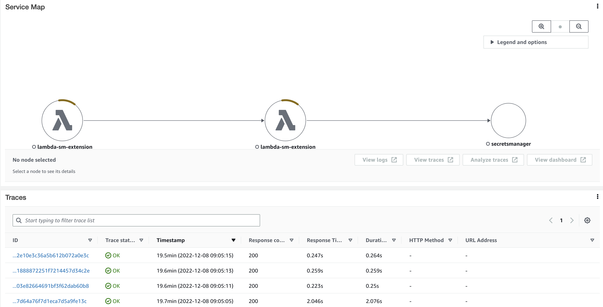
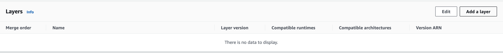
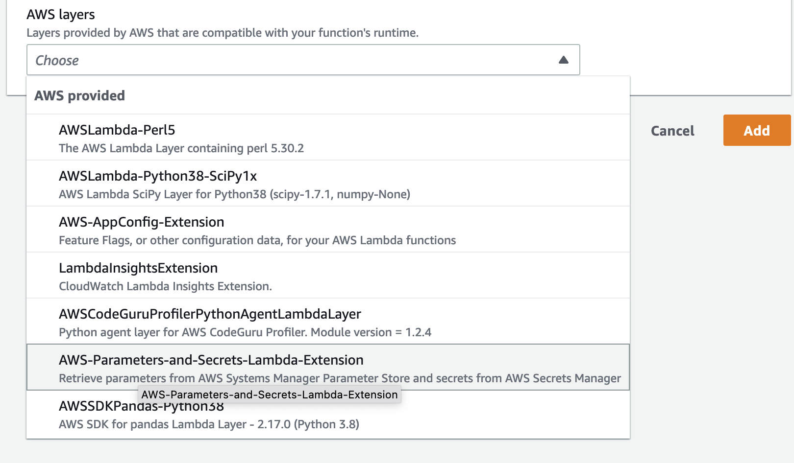
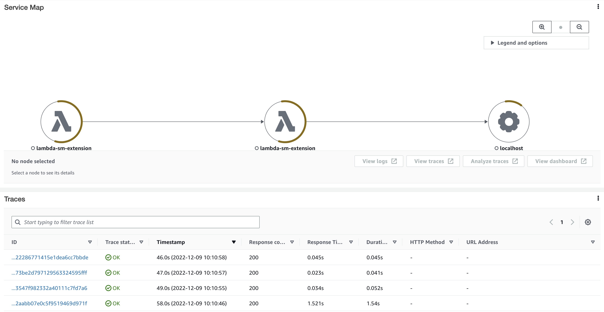

# Using The Lambda Secrets Manager Extension

On October 18th, 2022, AWS [announced](https://aws.amazon.com/about-aws/whats-new/2022/10/aws-parameters-secrets-lambda-extension/) a new Lambda extension that allows Lambda functions to pull secrets from a [Lambda Layer](https://docs.aws.amazon.com/lambda/latest/dg/configuration-layers.html) instead of making a round trip call to the AWS Secrets Manager service. This new extension can significantly reduce the invocation time of your functions. This article will walk through the steps of converting a function that accesses Secrets Manager directly to a function that uses the new extension.

Below is some sample code that accesses Secrets Manager directly:

```python
import boto3
from aws_xray_sdk.core import xray_recorder
from aws_xray_sdk.core import patch_all
import json

patch_all()

def lambda_handler(event, context):
    # Retrieve the secrets from Secrets Manager
    secrets_manager = boto3.client('secretsmanager')
    secrets = json.loads(secrets_manager.get_secret_value(
        SecretId='sm-lambda-extension'
    )["SecretString"])

    log_message = {
        'secret-one': secrets['secret-one'],
        'secret-two': secrets['secret-two'],
        'secret-three': secrets['secret-three'],
        'secret-four': secrets['secret-four'],
    }
    
    return log_message
```

Invoking the function results in the following trace in AWS X-Ray:


Notice how the function is making a call to the AWS Secrets Manager secret. The cold start took 2.046s and additional requests tok around 0.24s to complete.

Before updating your code to use the extension, you will need to add it to your Lambda function. In the console, click "Add a layer":


Then select the AWS-Parameters-and-Secrets-Lambda-Extension layer:


Next, we need to tell the extension which secrets to load. You do this by adding a file called `config.yaml` to the root of your project. This file must exist in the root of the zip file that gets uploaded to Lambda.

```yaml
SecretManagers:
  - secrets:
    - sm-lambda-extension
```

Now that we have added the layer, and directed the layer to pull our secret, we can rewrite our function to pull secrets from the Lambda layer instead of accessing Secrets Manager directly. Here is the previous function rewritten:

```python
import boto3
from aws_xray_sdk.core import xray_recorder
from aws_xray_sdk.core import patch_all
import requests
import json
import os

patch_all()

SECRETS_EXTENSION_PORT = 2773
SECRETS_EXTENSION_ENDPOINT = f"http://localhost:{SECRETS_EXTENSION_PORT}/secretsmanager/get?secretId"

def retrieve_secrets(secret):
    Headers = { "X-Aws-Parameters-Secrets-Token": os.environ["AWS_SESSION_TOKEN"]}
    r = requests.get(f"{SECRETS_EXTENSION_ENDPOINT}={secret}", headers=Headers)
    return json.loads(r.json()["SecretString"])

def lambda_handler(event, context):
    secrets = retrieve_secrets('sm-lambda-extension')
    log_message = {
        'secret-one': secrets['secret-one'],
        'secret-two': secrets['secret-two'],
        'secret-three': secrets['secret-three'],
        'secret-four': secrets['secret-four'],
    }
    
    return log_message
```

What's happening is that the Lambda layer is fetching the secret as part of the extension startup. It makes the secret value available via an HTTP service that is running on localhost. This enables the secret to be fetched when the extension is initalized, as opposed to retrieving the secret on the first invocation.

Let's look at X-Ray after the switch to the new extension:


Notice that Secrets Manager is no longer accessed in the trace, the secrets are pulled from localhost instead. More importantly, the cold and warm invocations are significantly faster.

By default, the Lambda layer will cache your secrets for 10 minutes. More details on this and other options are available in the [Cache secrets using AWS Lambda extensions](https://docs.aws.amazon.com/prescriptive-guidance/latest/patterns/cache-secrets-using-aws-lambda-extensions.html) documentation.

Making secrets available do your Lambda function is a common requirement. By using the Lambda Parameters and Secrets Extension you can avoid making a round-trip call to Secrets Manager and pull the secrets from the Lambda layer instead. As demonstrated above, this can significantly improve the performance of your Lambda functions.
